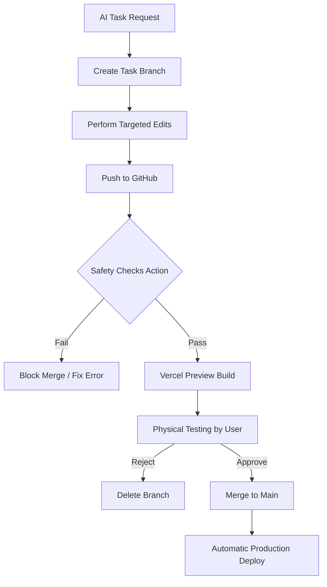

# Enterprise Safety & Automation Workflow (Aura Bloom)

This project uses an **Automated Safety Pipeline** to eliminate human error and ensure total production stability.

## 1. Automated Branch Protection
- **Main Branch Lock**: Direct commits to `main` are technically blocked by GitHub Actions.
- **PR Requirement**: All changes MUST go through a Pull Request.
- **Status Checks**: The "Safety Guard" action must pass before any code can be merged.

## 2. Environment Tiers (Automated)
| Environment | Domain | Purpose | DB Protection |
| :--- | :--- | :--- | :--- |
| **Development** | `localhost` | Local AI tasks. | Manual Dev DB |
| **Preview** | `*.vercel.app` | Physical testing. | **LOCKED** (Cannot use Prod DB) |
| **Production** | `aurabloom-blond.vercel.app` | Live Store. | **Production DB** |

## 3. Database Safety Logic
- **Runtime Guard**: The app will CRASH on purpose if it detects the Production Database ID being used on a Vercel Preview branch.
- **Zero Production Mutations**: No code change is allowed to modify the database schema without a verified migration log in `TASK_MANIFEST.md`.

## 4. CI/CD Pipeline Flow

## 5. Rollback Strategy
- **Code Rollback**: If a bug is found after merge, use GitHub to "Revert" the PR instantly.
- **Data Rollback**: If a database migration fails, we revert the `schema.sql` and apply the backup via Supabase Dashboard.

## 6. Audit Requirement
Every task must still be recorded in [TASK_MANIFEST.md](file:///d:/000000000/Devsfolk-Projects/Aura-Bloom/Aura-Bloom/Aura-Bloom/TASK_MANIFEST.md) for enterprise-grade accountability.
