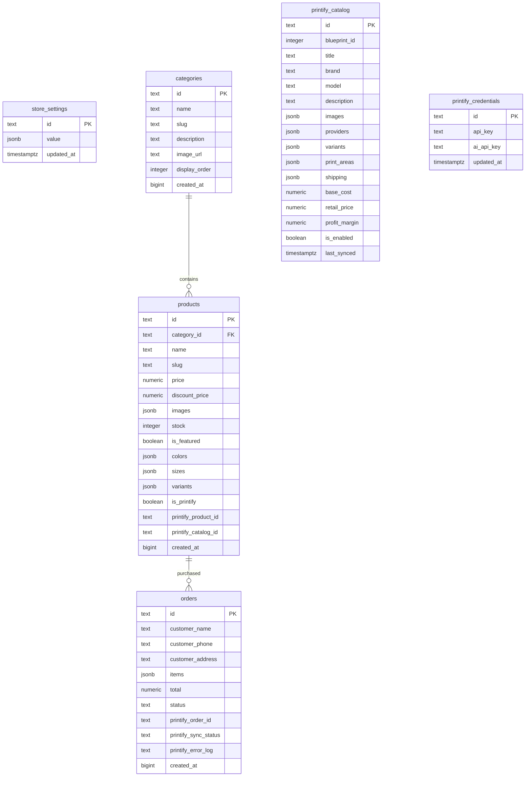
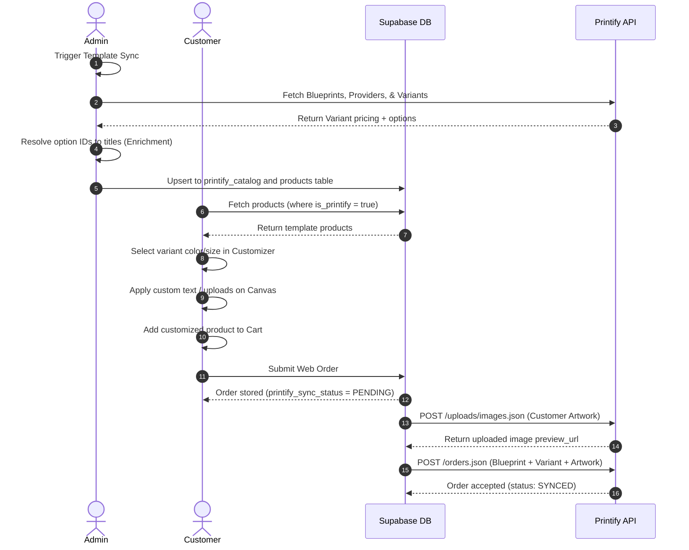

# Printify Integration Audit & Technical Investigation

This document provides a comprehensive analysis of the current issues, Printify API capabilities, Supabase database storage structures, data flow, and gap analysis for the Printify integration in the DevsFolk platform.

---

## Section 1: Current Issues

This section documents the currently known storefront customizer and database sync issues.

### Issue 1: Synced Templates Show Identical Pricing ($20.99)
* **Description:** Synced catalog templates (Shoe, Pants, T-shirt) all display an identical retail price of `$20.99` in the Customizer catalog selection list and editor.
* **Expected Behavior:** Each template should display a retail price computed from its specific base cost (provided by Printify) plus the admin's display markup percentage.
* **Actual Behavior:** Shoe, Pants, and T-shirt templates all display `$20.99` under the template selection panel.
* **Suspected Root Causes:**
  1. **Stale Supabase Database Records:** Stale template products exist in the `products` table carrying a price of `0`. When the storefront loads, it fetches these templates from the `products` table instead of the catalog templates table.
  2. **Fallback Price Calculation:** In `BespokeCustomizer.tsx`, if the product price is `0` or undefined, it falls back to `charges.templateBasePrice` (default `$14.99`). Applying a `40%` display markup (`$14.99 * 1.40`) results in exactly `$20.99`.
  3. **Sync Pipeline Normal Path Gap:** In `ShopContext.tsx`, `upsertPrintifyCatalogTemplates` only updates the `products` table in its fallback path (when the `printify_catalog` relation is missing). The normal path successfully updates the `printify_catalog` table but leaves the `products` table with stale `$0` records.
* **Files Involved:**
  * [ShopContext.tsx](file:///d:/000000000/Devsfolk-Projects/Devsfolk-Main/src/context/ShopContext.tsx) (`upsertPrintifyCatalogTemplates`, `calculatePrintifyRetailPrice`, `templateToProduct`)
  * [BespokeCustomizer.tsx](file:///d:/000000000/Devsfolk-Projects/Devsfolk-Main/src/components/printify/BespokeCustomizer.tsx) (`activeBaseCostDollars`, `templateToEditorProduct`)

### Issue 2: Price Does Not Change Between Sizes
* **Description:** Size options are visible in the Customizer editor (e.g. S, M, L, XL), but selecting a different size does not update the displayed customized retail price.
* **Expected Behavior:** Selecting larger variants (e.g., XXL or 3XL) that carry higher print-on-demand base costs from Printify should dynamically update the displayed retail price.
* **Actual Behavior:** The customized price remains static regardless of the size chosen.
* **Suspected Root Causes:**
  1. **Option Enrichment Failure:** Printify variant payloads return option values as raw integers (e.g. `[78, 12]`). During template sync, if the blueprint options lookup (`fetchPrintifyBlueprintDetail`) fails or is skipped, option resolution is skipped.
  2. **Variant Parsing Breakage:** If options are not enriched into objects (e.g., `{ name: "Size", title: "S" }`), the customizer cannot parse options from `activePrintifyVariant.options`. It falls back to splitting variant titles, but raw variants from the Printify API do not include `title` or `name` fields.
  3. **Fallback to First Variant:** When size matching fails because options cannot be parsed, the customizer falls back to the first available variant, resulting in static pricing across all size options.
* **Files Involved:**
  * [BespokeCustomizer.tsx](file:///d:/000000000/Devsfolk-Projects/Devsfolk-Main/src/components/printify/BespokeCustomizer.tsx) (`getVariantSize`, `getVariantOptionText`, `activePrintifyVariant`, `activeBaseCostDollars`)
  * [PrintifySettings.tsx](file:///d:/000000000/Devsfolk-Projects/Devsfolk-Main/src/pages/dashboard/PrintifySettings.tsx) (Sync template enrichment loop)

### Issue 3: Selecting a Different Color Does Not Update the Product Image
* **Description:** Color variants (e.g. Charcoal, Black, Forest Green) are displayed as selectors, but clicking them does not update the mockup product preview image in the canvas area.
* **Expected Behavior:** The main template product mockup should swap to show the product in the selected color.
* **Actual Behavior:** The product image remains static on the default color (the first image in the product's image list).
* **Suspected Root Causes:**
  1. **Mockup Source Hardcoding:** The mockup image source in the Customizer JSX was hardcoded to load `activeProduct.images[0]`.
  2. **Missing Fuzzy Image Swapper:** No logic existed to parse and match the `selectedColor` name (e.g. "White", "Navy") against the filenames/URLs in `activeProduct.images` (which typically contain color strings).
* **Files Involved:**
  * [BespokeCustomizer.tsx](file:///d:/000000000/Devsfolk-Projects/Devsfolk-Main/src/components/printify/BespokeCustomizer.tsx) (Main template preview `` tag and `generatePreviewDataUrl` drawing logic)

### Issue 4: Print Areas Appear Identical Across Templates
* **Description:** Bounding containers for design customizer canvas layers (e.g., where customers place text or graphics) use a static structure instead of loading custom dimensions from Printify.
* **Expected Behavior:** The Customizer bounding box dimensions, aspect ratio, and relative positioning should change dynamically depending on the product type (e.g., T-shirt front center vs. Mug full wrap vs. Vertical Poster).
* **Actual Behavior:** Bounding boxes are determined by a generic hardcoded helper inside the component.
* **Suspected Root Causes:**
  1. **Generic Coordinates Mapping:** `BespokeCustomizer.tsx` uses a simple local string-matching helper (`getPrintAreaStyle`) that maps name keywords (e.g., "poster", "mug", "case") to static percentages.
  2. **Unparsed Catalog Metadata:** Although Printify provides precise pixel size, placeholder placement, and print area dimensions within the blueprint `print_areas` object, this detailed catalog data is not currently parsed by the frontend layout calculator.
* **Files Involved:**
  * [BespokeCustomizer.tsx](file:///d:/000000000/Devsfolk-Projects/Devsfolk-Main/src/components/printify/BespokeCustomizer.tsx) (`getPrintAreaStyle`)

---

## Section 2: Printify Full Access API Research

This section catalogs the core endpoints, request structures, and data structures exposed by the Printify Full Access API.

### 1. Blueprints (Catalog Templates)
* **What Printify Provides:** A list of raw base products (blueprints) available for customization, including descriptions, brands, models, and image arrays.
* **Endpoint:** GET `https://api.printify.com/v1/catalog/blueprints.json`
* **Response Structure:**
  ```json
  [
    {
      "id": 6,
      "title": "Unisex Jersey Short Sleeve Tee",
      "description": "This classic unisex jersey...",
      "brand": "Bella+Canvas",
      "model": "3001",
      "images": [
        "https://images.printify.com/mockups/..."
      ]
    }
  ]
  ```
* **Usability:** Displaying customizer catalog selection grid.
* **Supabase Storage:** Stored in `printify_catalog` (with blueprint properties mapped) to prevent repeating high-latency API catalog lookups.

### 2. Print Providers
* **What Printify Provides:** A list of print fulfillment facilities that print, pack, and ship a specific blueprint.
* **Endpoint:** GET `https://api.printify.com/v1/catalog/blueprints/{blueprint_id}/print_providers.json`
* **Response Structure:**
  ```json
  [
    {
      "id": 16,
      "title": "Monster Digital",
      "location": { "country": "US", "region": "FL" }
    }
  ]
  ```
* **Usability:** Used in dashboard to find eligible print fulfillers.
* **Supabase Storage:** Stored as JSONB in `printify_catalog.providers`.

### 3. Variants
* **What Printify Provides:** Technical details for every size, color, and fit option combined for a blueprint and print provider.
* **Endpoint:** GET `https://api.printify.com/v1/catalog/blueprints/{blueprint_id}/print_providers/{print_provider_id}/variants.json?show-out-of-stock=1`
* **Response Structure:**
  ```json
  {
    "variants": [
      {
        "id": 37042,
        "cost": 850,
        "price": 1417,
        "is_enabled": true,
        "is_available": true,
        "options": [12, 79]
      }
    ]
  }
  ```
  * *Important Fields:* `id` (numeric variant ID), `cost` (base cost in cents), `price` (retail price in cents), `options` (associated option value IDs).
* **Usability:** Setting color/size variant prices and identifying specific SKU targets.
* **Supabase Storage:** Stored as JSONB in `printify_catalog.variants`.

### 4. Blueprint Detail (Variant Options Metadata)
* **What Printify Provides:** Human-readable string lookups mapping option value IDs to names, titles, and colors.
* **Endpoint:** GET `https://api.printify.com/v1/catalog/blueprints/{blueprint_id}.json`
* **Response Structure:**
  ```json
  {
    "id": 6,
    "title": "...",
    "options": [
      {
        "name": "Sizes",
        "type": "size",
        "values": [
          { "id": 12, "title": "S" },
          { "id": 13, "title": "M" }
        ]
      },
      {
        "name": "Colors",
        "type": "color",
        "values": [
          { "id": 79, "title": "White", "colors": ["#ffffff"] }
        ]
      }
    ]
  }
  ```
* **Usability:** Used to map raw variant integers (`[12, 79]`) to display names ("S", "White") and color hex codes ("#ffffff").
* **Supabase Storage:** Stored temporarily or merged directly into the `printify_catalog.variants` array during sync.

### 5. Shipping Costs
* **What Printify Provides:** Detailed shipping price brackets by print provider, destination country, and shipping class.
* **Endpoint:** GET `https://api.printify.com/v1/catalog/blueprints/{blueprint_id}/print_providers/{print_provider_id}/shipping.json`
* **Response Structure:**
  ```json
  {
    "profiles": [
      {
        "variant_ids": [37042],
        "countries": ["US"],
        "first_item": { "cost": 450, "currency": "USD" },
        "additional_item": { "cost": 220, "currency": "USD" }
      }
    ]
  }
  ```
* **Usability:** Displaying precise shipping rates at checkout.
* **Supabase Storage:** Stored as JSONB in `printify_catalog.shipping`.

### 6. Artwork Uploads
* **What Printify Provides:** Media library storage for client designs. Converts base64 file payloads or public image downloads into permanent Printify image identifiers.
* **Endpoint:** POST `https://api.printify.com/v1/uploads/images.json`
* **Request Payload:**
  ```json
  {
    "file_name": "custom-graphic.png",
    "contents": "base64String..."
  }
  ```
* **Response Structure:**
  ```json
  {
    "id": "603f8f9024fba9001b...",
    "file_name": "custom-graphic.png",
    "width": 1200,
    "height": 1200,
    "preview_url": "https://images.printify.com/uploads/..."
  }
  ```
* **Usability:** Invoked dynamically on order creation to upload customer-created artwork to the Printify library.
* **Supabase Storage:** Not stored in DB.

### 7. Order Submission (Dynamic Fulfillment)
* **What Printify Provides:** Places a customer order directly into the print facility queue using either an existing Printify product ID or by creating/printing a dynamic custom product layout on the fly.
* **Endpoint:** POST `https://api.printify.com/v1/shops/{shop_id}/orders.json`
* **Request Payload:**
  ```json
  {
    "external_id": "ord_123",
    "label": "ord_123",
    "shipping_method": 1,
    "address_to": {
      "first_name": "John",
      "last_name": "Doe",
      "email": "john@example.com",
      "phone": "1234567890",
      "country": "US",
      "region": "CA",
      "address1": "123 Main St",
      "city": "Los Angeles",
      "zip": "90001"
    },
    "line_items": [
      {
        "blueprint_id": 6,
        "print_provider_id": 16,
        "variant_id": 37042,
        "quantity": 1,
        "print_areas": {
          "front": "https://images.printify.com/uploads/..."
        }
      }
    ]
  }
  ```
* **Usability:** Submitting completed website orders to Printify.
* **Supabase Storage:** Order mapping is saved in the `orders` table (fields `printify_order_id`, `printify_sync_status`, `printify_error_log`).

---

## Section 3: Supabase Printify Data Audit

This section documents the Supabase database tables, schema columns, data flow sequences, and mapped variables.

### 1. Table Schema Inventory



#### Table: `public.printify_catalog`
* **Purpose:** Stores the cached lists of blueprints, print providers, shipping rates, and variant option matrices.
* **Relationships:** Maps customizer templates to storefront categories.

#### Table: `public.products`
* **Purpose:** Stores the platform products. In the fallback design, custom templates are stored here under `id` prefix `printify_template_` to make them easily searchable alongside standard store products.

#### Table: `public.printify_credentials`
* **Purpose:** Holds the encrypted Printify API personal access tokens and optional AI pipeline parameters.

#### Table: `public.orders`
* **Purpose:** Stores checkout orders and tracks the asynchronous auto-fulfillment bridge sync state.

---

### 2. Columns Audit

| Table | Column Name | Data Type | Purpose | Sync Status / Used |
| :--- | :--- | :--- | :--- | :--- |
| `printify_catalog` | `id` | `text` | Primary key (`bp_{blueprint_id}`) | Synced / Used |
| `printify_catalog` | `blueprint_id` | `integer` | Raw numeric ID of the blueprint | Synced / Used |
| `printify_catalog` | `title` | `text` | Product name in customizer | Synced / Used |
| `printify_catalog` | `variants` | `jsonb` | Complete variants details list | Synced / Used |
| `printify_catalog` | `providers` | `jsonb` | Print providers shipping capabilities | Synced / Used |
| `printify_catalog` | `base_cost` | `numeric` | Lowest enabled variant base cost (cents -> dollars) | Synced / Used |
| `products` | `is_printify` | `boolean` | Flag identifying customized template products | Stored / Used |
| `products` | `printify_catalog_id` | `text` | Blueprint ID linking to template records | Stored / Used |
| `products` | `variants` | `jsonb` | Array of mapped checkout variant details | Stored / Used |
| `orders` | `printify_order_id` | `text` | Printify internal order tracker ID | Populated post-fulfillment |
| `orders` | `printify_sync_status`| `text` | Auto-fulfillment status (`PENDING`, `SYNCED`, `FAILED`) | Populated post-fulfillment |
| `orders` | `printify_error_log` | `text` | Verbose errors from Printify order API | Populated post-fulfillment |

---

### 3. Data Flow Architecture



---

### 4. Gap Analysis

1. **Stale Products table sync:**
   * *Gap:* Syncing previously saved catalog templates directly to `printify_catalog` but skipping writing to `products` created stale products carrying a `$0` price.
   * *Solution:* Refactor the sync to always write to the `products` table in the normal flow.
2. **Variant option enrichment vulnerabilities:**
   * *Gap:* If blueprint metadata is unavailable or the API call fails during template sync, the options array remains an array of raw integers, breaking variant parsing in the Customizer frontend.
   * *Solution:* Implement fallback option parser regex mapping color/size titles directly from variants or display lists if options lookup is incomplete.
3. **Product mockup color mapping:**
   * *Gap:* Synced blueprint images are fetched as a single flat array without variant association, leaving the frontend with no mapped path from the selected color to the corresponding mockup image.
   * *Solution:* Implement a fuzzy token image filename match on color selection changes.
4. **Generic print areas:**
   * *Gap:* Printify provides full dimension details (placeholders, sizes) for customize areas, but they are not currently stored/passed to the Customizer frontend layout calculator.
   * *Solution:* Map the template's actual `print_areas` payload dynamically to set customizer canvas bounds.
